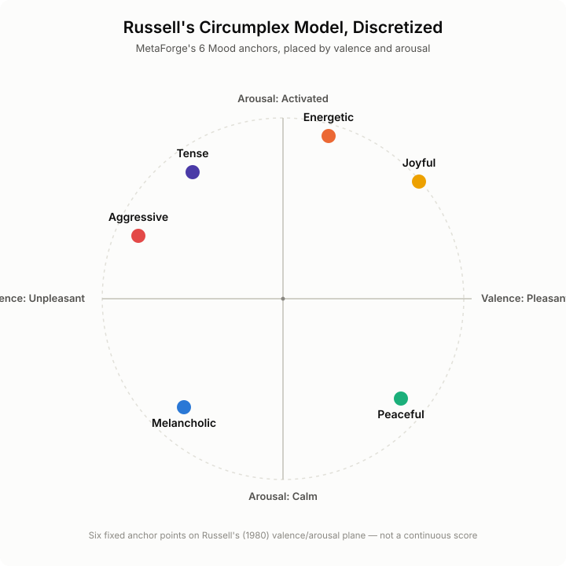
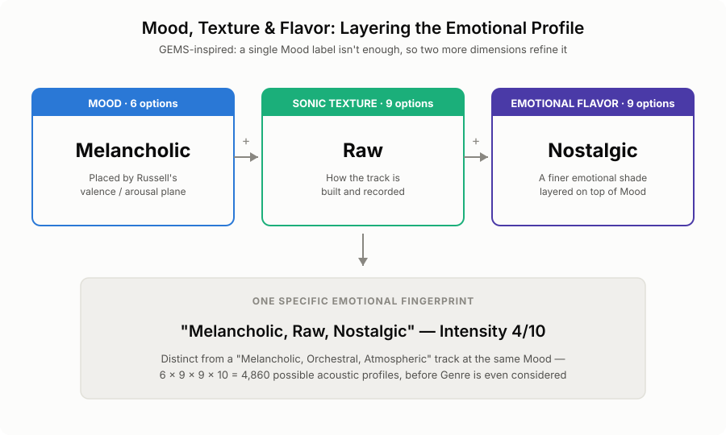

# MetaForge Intelli-Tagger: The Intelligent Tagging Tool for Serious Collectors

MetaForge Intelli-Tagger is a **dual-layer forensic suite** designed for collectors who treat their music library as a high-value archive. By unifying automated repair, deep acoustic analysis, and Google’s Gemini AI, MetaForge Intelli-Tagger transforms fragmented collections into a professionally curated, data-rich digital archive that grows in value over time.

MetaForge Intelli-Tagger is built for both **surgical precision and massive scale**. The workflow is designed to accommodate the remediation of a single, prized digital album or the bulk processing of an entire artist's discography in a single pass. By automating the repetitive tasks of repair and sanitation while maintaining AI-driven accuracy, MetaForge Intelli-Tagger allows you to process hundreds of tracks with zero loss in metadata quality.

Currently developed for **.mp3** music files to align with the **ID3v2.3 protocol** (the industry standard for maximum compatibility across players and hardware), future generations will also support lossless formats such as **.flac**, for collectors who value that digital format.

---

## The MetaForge Intelli-Tagger Workflow

### 1. Structural Health Check & Repair
Upon loading your "album" into the tool, MetaForge Intelli-Tagger performs a **"medical" exam** of your mp3 files. It identifies and repairs:
*   Internal corruption
*   Header errors
*   Truncated data

If a file is critically damaged, it is logged and isolated, ensuring your library contains only healthy, structurally sound audio.

### 2. Clean-Slate Metadata "White List" Scrub
Music files often arrive cluttered with "metadata cruft": legacy comments, encoded-by strings, and non-standard tags from old software. MetaForge Intelli-Tagger executes a surgical strike, wiping away all non-essential data. While individual file size reduction is nominal, removing this dead weight across tens of thousands of tracks results in a measurable reduction in overall library size.

**Only a strict "Whitelist" of high-value tags is permitted to remain:**
*   **Core Identity:** Artist, Album, Track Title, and Track Number.
*   **Forensic IDs:** Key MusicBrainz Identifiers and AcoustID fingerprints.
*   **Acoustic Data:** BPM, Musical Key, Mood, and Intensity.
*   **Archival Metadata:** Original Release Year, Record Label, and Personnel credits.

This ensures your library is not just organized, but **unified**—free from the conflicting tagging styles and bloat of a dozen different legacy sources.

### 3. AI-Powered Taxonomy & Acoustic Analysis
This is arguably the most important section of the MetaForge Intelli-Tagger workflow — it's what turns a folder of audio files into a structured, queryable archive, and it's the direct data foundation upon which the future Intelligent Playlist Generator (below) will be built on.

**Genre / Sub-Genre: an editable taxonomy.** Free-text genre tags are one of the biggest sources of "metadata cruft" in a legacy library — the same album might be tagged `Rock`, `rock`, `Classic Rock`, or `Rock; Pop` depending on which ripping tool or online database touched it last. MetaForge Intelli-Tagger solves this at the root with a **fixed, curated Genre / Sub-Genre taxonomy** rather than letting genre tags accumulate free-form. Every track is classified against a single, controlled vocabulary of primary genres (Blues, Gospel, Reggae, Swing & Standards, and dozens more) and their specific sub-genres (e.g., *Blues* → Delta Blues, Chicago Blues, Electric Blues, Texas Blues). This taxonomy is **fixed by default, but fully editable** — because your genre structure should reflect your own collection's needs, not someone else's.

**Mood, Texture & Flavor: a fixed, universal scale.** The acoustic and emotional dimensions below are deliberately *not* user-editable — for the opposite reason Genre is. For MetaForge (and its future Intelligent Playlist Generator) to meaningfully compare a Blues track against a Reggae track, "Melancholic" has to mean the same thing on both — a personal, per-library taxonomy would break that comparison. Google's **Gemini AI** acts as a digital musicologist here, weighing the artist, title, and the track's own acoustic fingerprint to place every track on a **Russell/GEMS Hybrid scale** — an algorithm inspired by both James Russell's Circumplex Model of Affect and the Geneva Emotional Music Scale (GEMS)[^1]. Russell's model contributes the underlying structure: rather than a vague or arbitrary mood label, every track is placed against a proven two-dimensional map of *valence* (pleasant to unpleasant) and *arousal* (calm to activated), discretized into six archival anchor points. GEMS — developed specifically for music, rather than emotion in general — contributes the guiding idea that a single mood label isn't enough, which is why two further descriptive dimensions are layered on top[^2]:

*   **Acoustic Mood:** The core emotional placement — *Peaceful, Joyful, Tense, Melancholic, Energetic,* or *Aggressive*.
*   **Sonic Texture:** How the track is actually built and recorded — *Acoustic, Synthetic, Organic, Polished, Raw, Lo-Fi, Hi-Fi, Minimal,* or *Orchestral*.
*   **Emotional Flavor:** A finer emotional shade layered on top of Mood — *Nostalgic, Dreamy, Dark, Playful, Hopeful, Intense, Atmospheric, Driving,* or *Smooth*.
*   **Intensity Scoring:** Unlike Mood, Texture, and Flavor, Intensity isn't an AI judgment call at all — it's measured directly from the track's own audio signal, producing a genuinely objective **1 to 10** physical energy score. While Mood describes how the music feels, Intensity measures the "sonic mass."

<picture>
  <source media="(prefers-color-scheme: dark)" srcset="docs/images/mood-circumplex-dark.svg">
  
</picture>

<picture>
  <source media="(prefers-color-scheme: dark)" srcset="docs/images/mood-layering-dark.svg">
  
</picture>

Standard shuffle-style playlists tend to fail in two ways: they jump from a high-energy track straight into a quiet ballad, or they clash keys mid-transition the way a skilled DJ never would. Intensity isn't the only dimension MetaForge measures directly from the audio signal, either — every track's **BPM** (tempo, via real beat-tracking) and **Musical Key** (via chromagram harmonic analysis) are captured the same way, not guessed at by an AI. Combined with the AI-classified Genre, Sub-Genre, Mood, Sonic Texture, and Emotional Flavor above, these become permanent, queryable fields — written directly into the file's own tags *and* indexed in the Local Master Database (below) — giving the future Intelligent Playlist Generator a genuinely multi-dimensional fingerprint for every track. A measured Intensity score can drive a **Linear Ramp**; a measured Key can drive harmonic mixing that never clashes; Mood, Texture, and Flavor together can drive emotionally coherent transitions between tracks, even across genres. This is the foundation the Intelligent Playlist Generator is built on — mathematical rigor, not guesswork.

**Why this much rigor, for every single track?** Because a playlist engine can only ever be as smart as the data underneath it — and not every dimension earns that rigor the same way. Genre and Sub-Genre are **editable** because your library's shape is yours to define, not MetaForge's to dictate. Mood, Sonic Texture, and Emotional Flavor are **fixed** because they only work as a comparison tool if "Melancholic" means the same thing on every track you own — a personal taxonomy here would quietly break every cross-genre connection the Playlist Generator could otherwise make. BPM, Key, and Intensity are **measured**, not judged, because a beat and a key change are facts about the audio, not opinions about it. Three different design choices, one shared purpose: turning a folder of audio files into coordinates precise enough for the Intelligent Playlist Generator to navigate with real intent — not a shuffle button's guesswork.

### 4. Visual Verification & Export
As MetaForge Intelli-Tagger processes your audio files, it provides a **visual verification** of the remediation. You can see—in real time—the step-by-step process, confirming the work performed and providing total transparency into every surgical remediation step.

### 5. The MetaForge Local Master Database
The biggest value proposition of the MetaForge system is the **Local Master Database**. While standard taggers update a file and forget it, MetaForge Intelli-Tagger builds a sophisticated, custom database stored locally on your machine.

*   **Source of Truth:** Acts as your private archival data store that exists independently of the music files.
*   **Flexibility:** Allows you to curate, explore, and manipulate your library in ways that file-based tagging simply cannot support.
*   **Privacy:** Your curation remains permanent and immune to the shifting metadata or licensing changes of cloud-based streaming services.

---

## Future-State: The Intelligent Playlist Generator
The ultimate goal of this robust database curation is the **MetaForge Intelligent Playlist Generator**. More than just a "randomizer," it will use your local database to build mixes with mathematical precision.

Because every track is indexed by fixed Genre and Sub-Genre taxonomies, BPM, Key, Mood, and Intensity, you will soon be able to use **plain-language AI prompts** to generate surgical playlists. Whether you ask for *"90 minutes of high-intensity 120BPM Swing"* or *"A chill, mellow afternoon set that transitions from Jazz to Soul,"* the resulting playlist will surpass the quality of any other tool in the market today.

**The MetaForge Intelligent Playlist Generator is slated for release later in 2026.**

---

[^1]: Russell, J. A. (1980), *A Circumplex Model of Affect* — background on emotion/mood classification models: [Tufts EE Senior Design Handbook, "Music Mood Classification"](https://sites.tufts.edu/eeseniordesignhandbook/2015/music-mood-classification/).
[^2]: Geneva Emotional Music Scale (GEMS), developed at the University of Geneva's Swiss Center for Affective Sciences: [UNIGE CISA, "Culture and Arts"](https://www.unige.ch/cisa/research/topics/culture-and-arts).
